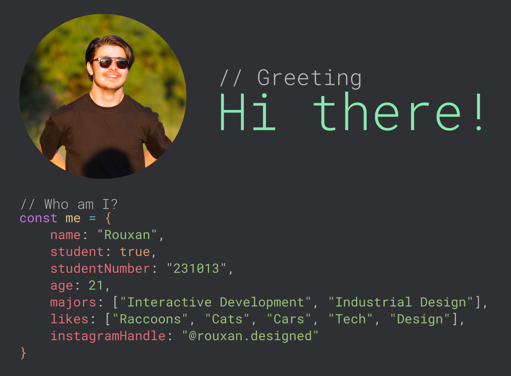

[]

Hey there 👋

I’m Rouxan, a creative technologies student focusing on industrial design and web development. My work merges technical expertise with a passion for functional, minimalistic design, tackling everything from custom-built furniture to innovative software solutions.

I believe in crafting meaningful user experiences that are both practical and elegant. Currently, I’m working toward building my own industrial design studio, with a vision of combining technological innovation with creative thought to create impactful, high-end products.

---

## 📁 Featured Projects - DV200

---

## &#x1f4c8; GitHub Stats

---

## 💼 Skills

---

## 🌱 What’s Next?

With a vision for innovative design, I’m constantly exploring ways to push the limits of both technology and aesthetics. I’m excited to keep advancing in areas like IoT, ESP32, UXD, and Sheet Metal Design. Let’s connect, via my socials lsited above, and build something impactful together! 🚀
